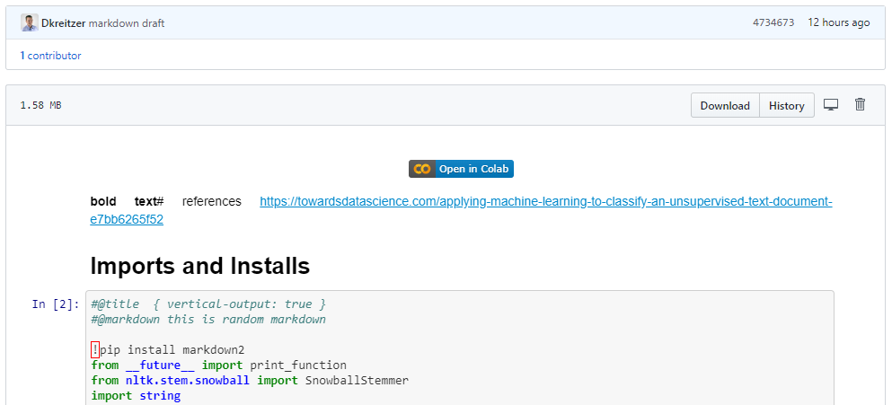
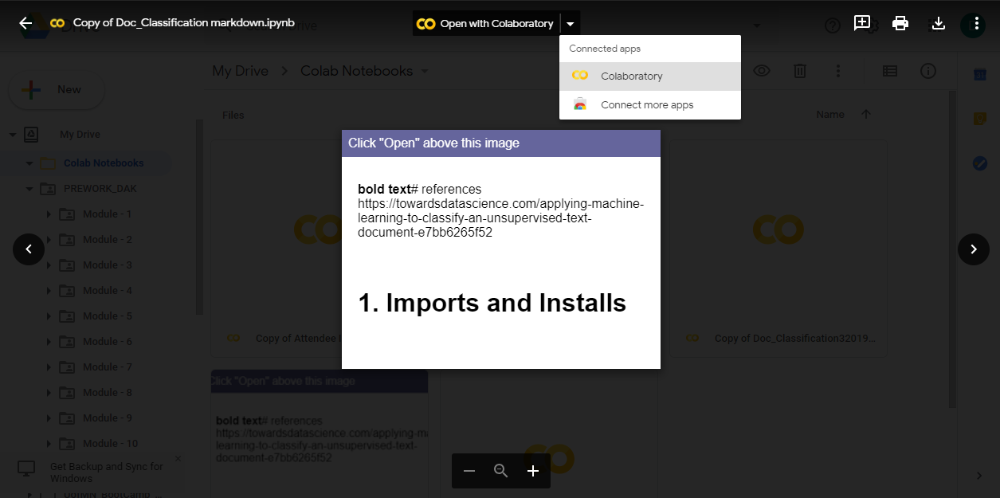
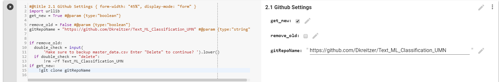
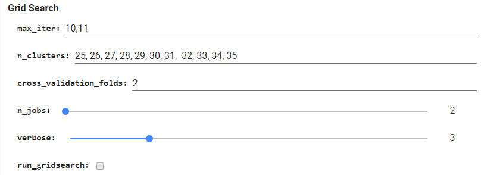
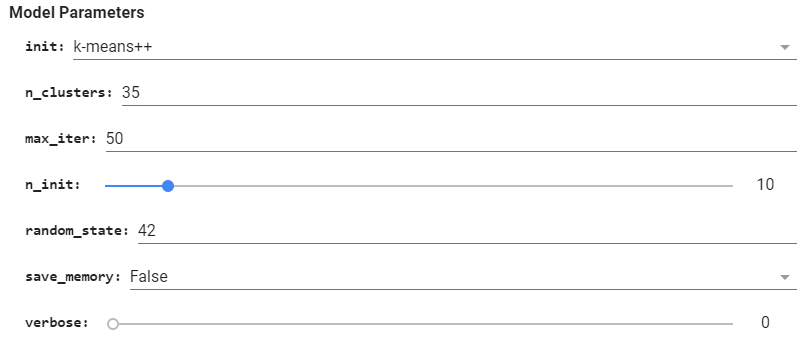
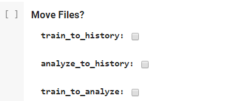

# Machine-Learning Text Classification Notebook (MLTCN)

The MLTCN was created to enable users with little to no programming expertise to classify text documents using unsupervised machine learning.

One of the first challenges we wanted to overcome was accessibility – how could we make this easy for our target audience to use the code? We started exploring online notebook options and chose to utilize .

Colab Benefits:
- Anyone with a google account can open an ipynb file from GitHub or their Google Drive in seconds – without having to load any software on their computer.
- Some of the libraries we utilize can be temperamental (they don’t always comingle well with other libraries) – but with Colab the user doesn’t have to download, configure, or trouble shoot any library settings.
- Files can be saved directly to Google Drive and GitHub accounts, making it incredibly easy to share notebooks and outputs. 
Currently the notebook is configured specifically for Colab, but it can be downloaded and run on local notebooks (i.e. Jupyter Notebook).
 

### How to use MLTCN Colab:

#### Setup:
1.	Fork the MLTCN repo into your own Github Account or save the repo in your Google Drive.
2.	Open Doc_Classification_colab.ipynb in colab’s environment.
  - Github: click the link and it will open automatically.
  

  - Google Drive: Open the file and select 'open with colabratory' button.
  

3. Modify path to cloan Github Repo

#### File Structure

Important: The file structure below needs to remain the same for the program to automatically pull and save files properly. Do not delete, move, or rename any of the following folders unless you are changing the file path within the cells:

root/  
root/Model 
root/Model/Model1 
root/Train 
root/Analyze 
root/Predicting 
root/History 
 

 

### Processes
The notebook has been configured so you can:
1. Add text files to train a model
2. Predict text files and generate visuals
3. Load CSV file (previously predicted data) to generate visuals

#### Train a new model:
1. Add text files to the Train folder (root/Train)
2. Verify or adjust Grid Search settings

3. Verify or adjust Model Parameters

4. Select where to save the new model

5. Execute Cells:
    - 1 - 1.4 (Imports & Installs)
    - 2 - 2.2 (Download Files)
    - 3 - 3.6 (Vectorization)
    - 4 - 4.6 (Model Training)

#### Analyze Text Files:
1. Add text files to the Analyze folder (root/Analyze)
2. Select which model you want to use (from models you have saved either locally or in your GitHub repo)
3. Choose where to save master.csv results
4. Execute Cells:
    - 1 - 1.4 (Imports & Installs)
    - 2 - 2.2 (Download Files)
    - 3 - 3.6 (Vectorization)
    - 5 - 5.4 (Load Model)
    - 6 - 6.3 (Predictions)
    - 7 - 7.3 (Predict Text Files)

#### Visualizations

