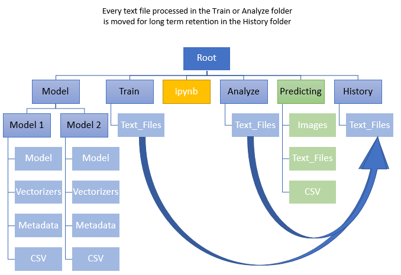

# Text_ML_Classification_UMN
Jupyter Notebook that can classify and visualize text files using Machine Learning

Temp:

File Structure

root/  
root/Model 
root/Model/Model1 
root/Train 
root/Analyze 
root/Predicting 
root/History 

Text_ML_Classification_UMN/Model
